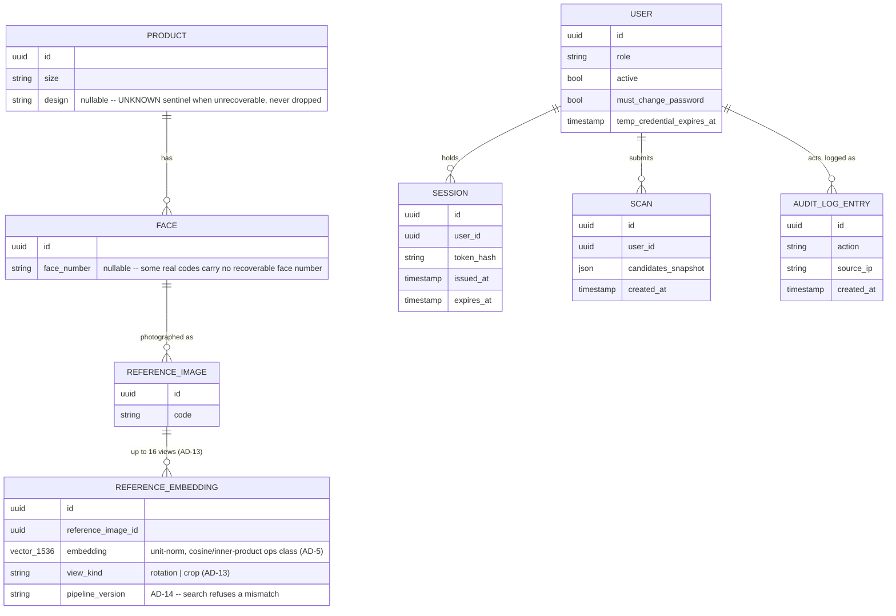

# Architecture Spine — Rocell Tile Identification App

## Design Paradigm

Layered monorepo with a shared domain core. `shared/vision` and `shared/schema` are the domain core — pure, no HTTP or I/O-adapter specifics. Two adapters call into that same core identically: `apps/api` (the live HTTP adapter serving both staff scans and admin catalogue writes) and `scripts/ingest` (the offline batch adapter). `apps/web` is presentation only, and talks to nothing but `apps/api`. `infra` carries deployment and IaC, no business logic.

`scripts/ingest` is scoped to the one-time Phase 0 dataset migration only — it runs before there's a live staff/admin population or an audit trail to protect, under its own operator-scoped database credentials, separate from `apps/api`'s runtime role. It is never invoked from `apps/api` or triggered by any in-app action. Any post-launch bulk load (a large new range arriving after Foundation build) goes through FR-17's `apps/api`-mediated endpoint instead, which is within AD-4's live audit trail. This is a scope boundary, not a gap in AD-4's coverage.

```mermaid
graph LR
  web["apps/web (PWA)"] -->|HTTP, authenticated| api["apps/api (FastAPI)"]
  api --> vision["shared/vision (domain core)"]
  ingest["scripts/ingest (pre-launch only)"] --> vision
  api --> schema["shared/schema"]
  ingest --> schema
  web -.->|type contracts only| schema
  api --> pg[(Postgres + pgvector)]
  api --> obj[(Object storage)]
  ingest -.->|pre-launch, operator credentials| pg
  ingest -.->|pre-launch, operator credentials| obj
  web -.x.->|forbidden, AD-6/AD-9| pg
  web -.x.->|forbidden, AD-6/AD-9| obj
```

## Invariants & Rules

### AD-1 — Index/query preprocessing and embedding symmetry `[ADOPTED]`

- **Binds:** `shared/vision`, `apps/api` (scan pipeline), `scripts/ingest` (index pipeline)
- **Prevents:** index-time and query-time embeddings drifting apart because the two pipelines evolved their preprocessing independently — silently destroys match accuracy with no error raised.
- **Rule:** Both pipelines call the exact same `shared/vision` function for preprocessing and embedding. Neither forks, wraps-and-diverges, or reimplements any part of it. A change to `shared/vision` requires a `make eval` run and invalidates the existing index. Both pipelines decode to an identical long-edge cap of 2048px before any other step — reference originals reach 19276×9638 px / 96MB, and none of that resolution reaches the model on either side (validated in a working POC, `poc/README.md`).

### AD-2 — Client-side resize is bandwidth optimization, not the preprocessing boundary `[ASSUMPTION]`

- **Binds:** `apps/web` (capture/upload), `shared/vision`
- **Prevents:** the query path's client-side canvas downscale (~1024px) being mistaken for part of AD-1's "must be identical" pipeline — reference images at index time are never client-downscaled, so relying on a specific client-side resolution would silently break symmetry.
- **Rule:** `shared/vision`'s preprocessing function accepts and correctly normalizes any input resolution or format. Client-side downscale exists only to shrink upload payload size; no server-side code may assume it produced a specific resolution.

### AD-3 — Session state, transport, and liveness `[ASSUMPTION storage / ADOPTED transport]`

- **Binds:** `apps/api` (auth/session)
- **Prevents:** a second stateful infrastructure dependency (Redis/Memcached) for session storage at a scale that doesn't need one; session-validation logic diverging across endpoints; a role edit (FR-12) or deactivation (FR-13) not taking effect until next login because role/active status was cached at login instead of re-read.
- **Rule:** Sessions are rows in a Postgres table, validated through one shared session-lookup function in `apps/api` — never a bespoke per-route check `[ASSUMPTION — revisit only if concurrent session volume becomes a measured bottleneck]`. That lookup re-reads the user's role and active status from Postgres on every request; neither is cached at login, so FR-12 and FR-13 take effect on the very next request. The session token itself is carried only in an HTTP-only, Secure, SameSite=Strict cookie — never in `localStorage`/`sessionStorage`, never readable by page script `[ADOPTED, AGENTS.md Policy]`.

### AD-4 — Audit-log immutability enforced at the database layer `[ADOPTED rule / ASSUMPTION mechanism]`

- **Binds:** `infra` (Postgres roles), `apps/api` (audit-write path)
- **Prevents:** a future endpoint or migration accidentally adding an UPDATE/DELETE path against the audit table — app-code-only enforcement can't guard against a later mistake.
- **Rule:** No update or delete path against the audit log exists, from application code or the admin UI `[ADOPTED, AGENTS.md Policy]`. The application's database role additionally has INSERT and SELECT on the audit table only — UPDATE and DELETE are not granted at the database level, so the invariant holds even against a bug, not just a reviewed pull request `[ASSUMPTION — the specific enforcement mechanism]`. A bad entry is corrected by inserting a new corrective entry, never by mutating the original. An entry's `source_ip` is read only from the trusted reverse-proxy's forwarded-IP header, set by `infra`'s own edge layer — never a raw client-supplied header (the specific proxy/hosting choice is Deferred; this trust boundary is fixed regardless of which one is chosen).

### AD-5 — pgvector HNSW index; hard delete, not soft `[ASSUMPTION]`

- **Binds:** `shared/vision` (embedding write path), `apps/api` (catalogue endpoints), `scripts/ingest`
- **Prevents:** catalogue-management code and bulk-ingestion code diverging on whether a newly-inserted embedding needs a manual rebuild before it's searchable; a removed Product or Reference Image (FR-15, FR-16) resurfacing as a Candidate because one query site forgot to apply a soft-delete filter another site remembered.
- **Rule:** The embedding column is indexed with pgvector's HNSW (not IVFFlat) — inserts are immediately part of the searchable graph, no manual reindex step. Removal is a hard delete from the embedding index, not a soft-delete flag filtered at query time — there is no filter to forget. Vectors are stored unit-norm, so cosine similarity is a single dot product — the HNSW index uses the cosine/inner-product ops class, never L2. Embedding dimension is fixed at 1536 (`concat(L2(CLS), L2(mean patch))`, then L2-normalized again — the model's own retrieval recipe, validated in a working POC, `poc/README.md`) — this pins pgvector's `vector(1536)` column.

### AD-6 — Web talks only to the API `[ADOPTED]`

- **Binds:** `apps/web`, `apps/api`, `infra` (Postgres, object storage)
- **Prevents:** `apps/web` acquiring direct credentials or a direct network path to Postgres or object storage, which would bypass server-side authorization on every request.
- **Rule:** Every read or write — including image upload — goes through an authenticated `apps/api` endpoint. `apps/web` holds no database or storage credential.

### AD-7 — One shared upload-intake path `[ASSUMPTION]`

- **Binds:** `apps/api` (Scan submission, catalogue image endpoints), `scripts/ingest` (bulk load)
- **Prevents:** the Scan-upload path, the catalogue-image-upload path, and bulk ingestion (FR-17) independently implementing — or forgetting — content-type validation, re-encoding, and EXIF-stripping.
- **Rule:** One shared upload-handling function (content-type sniff → re-encode → EXIF-strip) is used by the Scan submission endpoint, every catalogue-image endpoint, and `scripts/ingest`'s bulk loader. No code path writes an image to object storage without passing through it first. The same function detects and flags a zero-byte or unreadable image per-row during bulk ingestion (a working POC found 2 real zero-byte files in the actual source data, `poc/README.md`) rather than silently producing a garbage embedding from a corrupt file — surfaced through FR-17's existing per-row success/failure report, not a new mechanism.

### AD-8 — Rate-limit and anomaly counters live in Postgres, mutated atomically `[ASSUMPTION]`

- **Binds:** `apps/api` (login lockout FR-4, scan rate limiting FR-23, anomaly baseline FR-22)
- **Prevents:** a third stateful dependency for counters (in addition to AD-3's session table); login/scan/anomaly counting diverging if one endpoint tracks state in-process memory — which wouldn't survive a restart or a second `apps/api` instance — while another persists it; a concurrent burst of requests each reading the same stale count before any of them writes back, letting the burst blow past the very throttle FR-23 exists to enforce.
- **Rule:** Failed-login counts, scan-rate counters, and anomaly-baseline state are rows in Postgres, mutated through a single atomic increment-and-check operation (e.g. one `UPDATE ... RETURNING`, never a separate read then write) — and never in-process memory. Mirrors AD-3's reasoning: no counter-store dependency this scale doesn't need.

### AD-9 — No presigned or direct-to-storage URLs, upload or download `[ASSUMPTION]`

- **Binds:** `apps/web`, `apps/api`, `infra` (object storage)
- **Prevents:** a later "optimization" wiring `apps/web` to upload or download directly against object storage via a scoped/presigned URL — a common PWA pattern that would silently bypass AD-7's content-validation/re-encode/EXIF-strip on the way in, and bypass per-request authorization on the way out, without ever contradicting AD-6's literal wording (which forbids a held credential, not a short-lived token).
- **Rule:** `apps/web` never receives a presigned or otherwise directly-usable storage URL, for upload or download. Every image byte — a Scan or a Reference Image — is proxied through `apps/api`, which re-checks authorization on every request and applies AD-7's validation before any write. This extends AD-6 to close the scoped-token gap AD-6 alone leaves open.

### AD-10 — Scan history is a snapshot, never a live reference `[ASSUMPTION]`

- **Binds:** `apps/api` (scan submission write path), Scan storage, audit-log entries that name a Product or Reference Image
- **Prevents:** AD-5's hard delete of a removed Reference Image silently corrupting or orphaning past Scan history (FR-8); a foreign key from Scan or the audit log to Reference Image forcing a choice between blocking every deletion and cascading it in a way that contradicts AD-4's no-delete database grant.
- **Rule:** A Scan's returned Candidates are stored as a denormalized snapshot at scan time (code, size, design, and a reference-image identifier that may point to a since-deleted row) — never as an enforced foreign key to Reference Image. FR-8's history renders from the snapshot, unaffected by a later AD-5 deletion. The same snapshot-not-FK rule applies wherever an audit-log entry names a Product or Reference Image.

### AD-11 — Crop executes server-side in `shared/vision`, never client-side `[ASSUMPTION]`

- **Binds:** `apps/web` (crop UI), `apps/api` (Scan submission), `shared/vision`
- **Prevents:** two independent crop implementations (a client-side JS canvas crop vs. any future server-side need — e.g. applying the same crop to admin-added Reference Images) diverging in rounding, interpolation, or boundary-clamping edge cases, the same class of risk AD-1 exists to prevent for preprocessing generally. Also prevents a resolution/coordinate-scale mismatch: if crop coordinates were captured against a specific client-side pixel size, AD-2's downscale could silently invalidate them.
- **Rule:** `apps/web` presents the crop UI and sends the full — AD-2-downscaled, not the raw multi-MB original — image plus a normalized crop rectangle (0–1, relative to image width/height — never absolute pixels) as part of the Scan submission. AD-2's bandwidth-saving downscale still happens first; the crop rectangle is computed against whatever resolution the client actually uploads, which is exactly why it's relative, not absolute. The pixel crop itself is executed exactly once, server-side in `shared/vision`, immediately before the rest of AD-1's preprocessing — never as client-side canvas manipulation, never reimplemented elsewhere. This is why FR-24 doesn't break AD-1's index/query symmetry rather than merely not-breaking-it-by-luck: Reference Images are already expected to be tightly framed at index time (brief `addendum.md`, Target State for the Reference Set — "tile face fills the frame, no background clutter"), so a tightened, server-executed query-time crop moves the query path *closer* to what the index path already assumes, not further from it. Keeps crop, like preprocessing, in exactly one place, and makes it reusable for a Reference Image later without new client logic.

### AD-12 — Quality check runs after crop, on the cropped region `[ASSUMPTION]`

- **Binds:** `apps/api` (scan submission flow), `shared/vision`
- **Prevents:** one build treating FR-9's blur/framing check as a pre-crop gate — blocking the crop UI from even appearing on a capture whose *background* is blurry, which is irrelevant to the tile inside the crop — while another checks the post-crop region, the only version of the image that actually gets submitted and matched.
- **Rule:** FR-24's crop step always precedes FR-9's quality check in the flow. FR-9 evaluates the cropped region only, never the pre-crop full frame.

### AD-13 — Reference embeddings are multi-vector, max-pooled at query time `[ADOPTED, from a working POC]`

- **Binds:** `shared/vision`, `apps/api` (search path), `scripts/ingest`, the ERD
- **Prevents:** a builder shipping one embedding per Reference Image (this spine's own earlier ERD mistake) — pooling multiple views into a single vector at write time would give back the scale-invariance the views exist to buy, silently capping achievable accuracy.
- **Rule:** Each Reference Image contributes up to 16 embeddings — 4 clean rotations of the full frame plus 12 randomized augmented crops (scale 25–60%, carrying lighting/white-balance/blur/perspective/JPEG variation) — stored as separate rows in a child `ReferenceEmbedding` entity, never pooled into one vector per image. A Scan embeds exactly one view (the full cropped frame) — a second query-time view (a centre-zoom crop, max-pooled with the full frame) was measured to score *worse* (top-1 67.2%→65.6%, top-3 81.1%→79.5%) while doubling latency (440ms→206ms saved by dropping it), so none is added. Search compares that one Scan embedding against every `ReferenceEmbedding` row belonging to a candidate image and takes the **max** similarity across those views — never an average, never pre-pooled.

### AD-14 — The index carries a pipeline-version stamp; search refuses a mismatch `[ADOPTED, from a working POC]`

- **Binds:** `shared/vision`, `apps/api` (search endpoint), `scripts/ingest`
- **Prevents:** AD-1's re-index requirement being enforced only procedurally ("state it in the PR") — a step a person can simply forget, silently degrading accuracy with no error, which is exactly the failure mode AD-1 exists to prevent in the first place.
- **Rule:** Every `ReferenceEmbedding` row carries a `pipeline_version` stamp — a named version marker plus a computed hash of the preprocessing config, together identifying the exact `shared/vision` build that produced it (mirroring the POC's `PIPELINE_VERSION` constant + `config_hash()` pair). The check is global, not per-row: a search compares the currently-running pipeline's stamp against the single active generation being searched, not row by row. A re-index is built as a complete new generation of `ReferenceEmbedding` rows and cut over atomically — via a single active-generation pointer, not incremental per-row patching — so a Reference Image is never left mid-rebuild with some views on the old stamp and some on the new. A stamp mismatch on the active generation is a hard error, not a silent degraded search.

### AD-15 — Color management is mandatory in `shared/vision`, before any other step `[ADOPTED, from a working POC]`

- **Binds:** `shared/vision`
- **Prevents:** the exact bug a working POC found — roughly 60% of this catalogue's reference images are CMYK press files, not sRGB photographs. A naive `.convert("RGB")` discards the embedded color profile: measured on a 28-image sample as a 12.6-level average, 84.6-level peak channel shift, and up to 68 levels on one specific named tile — rendering it visibly the wrong color *and* embedding it from wrong pixels — a systematic domain gap the pipeline itself introduces, on top of and distinct from AD-2's studio-vs-phone gap. This binds `shared/vision` generally, not just the catalogue path — a phone photo can carry its own embedded ICC profile, and AD-1's symmetry means the same function runs on both.
- **Rule:** `shared/vision`'s image-loading step transforms any embedded ICC profile into sRGB at **relative colorimetric** rendering intent — never perceptual (measured mean brightness 25.0 vs. a ColorSync-verified reference of 84.2), never with black-point compensation (measured 41 — worse than perceptual alone), both badly wrong on these specific press profiles; relative colorimetric measured 84.3, within ~1 level of reference. A missing profile is assumed sRGB. This step is validated by a test asserting both hue *and* brightness — a fix that only corrects hue can still be badly wrong on brightness. Grey-world color constancy was tried as a related fix and rejected: these are full-bleed single-colour tiles, so the grey-world assumption (a scene averages to grey) is violated by construction — a genuinely pink tile is pink, not a color cast to correct. Do not reintroduce it without new evidence from real photos.

### AD-16 — Embedding inference is serialized; the model is warmed at startup `[ADOPTED, from a working POC]`

- **Binds:** `apps/api` (scan endpoint), `shared/vision` (inference call site)
- **Prevents:** a naive "handle requests concurrently" web-server default from being applied to a CPU-bound ONNX model — a working POC measured 8 concurrent scans running **12× slower each** (206ms → 2.6s) because every request's inference threads oversubscribe the same CPU cores. This is a correctness/performance invariant, independent of AD-8's per-user abuse-defense rate limiting — a legitimate single user scanning at a normal pace can still trigger this collapse if a second scan runs in parallel.
- **Rule:** One scan's embedding forward-pass runs at a time, server-wide — a second concurrent scan waits rather than running in parallel. The ONNX session is created once at server startup, not per-request (session creation costs ~900ms), behind an initialization lock so two simultaneous first-scans can't each build a duplicate session. Fixed order on every scan request: session validation (AD-3) → AD-8's rate-limit check → only then, acquire this AD's serialization slot for inference. A throttled or unauthenticated request is rejected before it ever occupies the one inference slot — checking the limit only inside the critical section would let a rejected burst queue behind it anyway, reproducing the exact collapse this AD exists to prevent.

### AD-17 — Reference images are served from a pre-generated, capped derivative `[ADOPTED, from a working POC]`

- **Binds:** `apps/api` (catalogue read path), the catalogue-write path (`apps/api` add/edit/bulk-load, `scripts/ingest`)
- **Prevents:** the exact bug a working POC found — building a reference view on demand means decoding an original up to 96MB, measured at 1–3.5 seconds per request. FR-7 requires a reference image on every Candidate; serving the original or generating on the fly would silently violate the product's speed expectations even though matching itself stays within budget.
- **Rule:** A capped-size derivative (POC validated: ~1280px long edge, ~300KB budget) is generated once, at catalogue-write time — never at read time. The original asset is never served directly to `apps/web`.

## Consistency Conventions

| Concern | Convention |
| --- | --- |
| Naming (entities, files, interfaces, events) | PRD Glossary terms (`Product`, `Design`, `Size`, `Face`, `Code`, `ReferenceImage`, `Scan`, `Candidate`, `Catalogue`, `Staff`, `Administrator`, `Session`) used verbatim as PascalCase type/entity names across `apps/api`, `shared/schema`, `apps/web`. No synonyms. |
| Data & formats (ids, dates, error shapes) | IDs: UUIDv4. Timestamps: ISO 8601 UTC. API error envelope: `{ "error": { "code": string, "message": string } }`. `[ASSUMPTION]` |
| Product identity shape | `Size` and `Design` are normalized into their own reference tables, not free text. Both `scripts/ingest` and `apps/api`'s catalogue endpoints resolve a size/design string against the same lookup (create-if-missing, case/whitespace-normalized) — never stored as ad hoc text that could drift into near-duplicate values across the two write paths. `[ASSUMPTION]` |
| State & cross-cutting (mutation, authz, audit) | All live, post-launch Postgres/object-storage mutation flows through `apps/api` (AD-6, AD-9); `scripts/ingest` is the sole, explicitly pre-launch exception (Design Paradigm). Every privileged action re-verifies role server-side per request (AGENTS.md Policy). Anything PRD FR-20 covers writes through the one audit-log path — never ad hoc logging. |

## Stack

| Name | Version |
| --- | --- |
| React | 19.2.x |
| Camera | Browser `getUserMedia`; client-side canvas downscale to ~1024px before upload (AD-2) |
| TypeScript | 7.0.x — Go-native compiler, GA July 2026, ~10x faster builds |
| Vite | 8.0.x — Rolldown (Rust) bundler, unified dev/build |
| Python | 3.12+ |
| FastAPI | 0.141.x |
| ONNX Runtime | 1.25.x (CPU) |
| Embedding model | `Xenova/dinov2-base` ONNX export specifically (86M params, Apache 2.0, already ONNX-exported — no export step of our own), validated in a working POC. DINOv3 outperforms it but ships under a restrictive license (approval process, mandatory attribution) — staying on DINOv2 is deliberate, not an oversight. |
| PostgreSQL | 18.x |
| pgvector | ≥0.8.2 — floor is load-bearing, not cosmetic: CVE-2026-3172 (buffer overflow, parallel HNSW index builds) affects 0.6.0–0.8.1 and AD-5 mandates HNSW. Confirm pgvector's PostgreSQL-18 compatibility at build time — verified testing as of this writing covers 16/17. |
| Object storage | S3-compatible API; provider deferred |
| Password hashing | Argon2id |

## Structural Seed

```text
apps/
  web/            # React PWA — capture UI, results, scan history, admin screens. Talks only to apps/api.
  api/             # FastAPI service — auth, scan submission, admin user/catalogue endpoints, audit log.
shared/
  vision/         # Crop (AD-11) + colour management (AD-15) + preprocessing + embedding
                  # (AD-1, AD-13), including the shared upload-intake path (content-sniff,
                  # re-encode, EXIF-strip — AD-7). Called identically by apps/api and
                  # scripts/ingest. Port directly from poc/tilematch/vision.py — written
                  # there to lift into this module unchanged, not as a reference to
                  # reimplement from.
  schema/         # Shared types/contracts between apps/web and apps/api.
infra/            # IaC, migrations, deployment config.
scripts/
  ingest/         # Drive → index batch ingestion. Calls shared/vision, shared/schema.
```



`SCAN.candidates_snapshot` and any audit-log field naming a Product/Reference Image are denormalized snapshots, not foreign keys (AD-10) — deliberately not drawn as ERD relationships to Reference Image, since none is enforced. `SCAN` deliberately carries no crop-rectangle field either: AD-11's crop is executed once, server-side, before the image is ever persisted — the rectangle is a transient request parameter, not stored state. `REFERENCE_EMBEDDING` is the child entity AD-13 requires — `REFERENCE_IMAGE` itself holds no vector; a removed `REFERENCE_IMAGE` (AD-5, hard delete) cascades to its embeddings, since nothing else ever references them directly (AD-10 already guarantees `Scan` history doesn't).

## Capability → Architecture Map

| Capability / Area | Lives in | Governed by |
| --- | --- | --- |
| §4.1 Auth & Session Management (FR-1–5) | `apps/api` auth module + Postgres `sessions` table | AD-3, AD-6, AD-8, AGENTS.md Policy |
| §4.2 Tile Scanning & Identification (FR-6–9, FR-24) | `apps/web` capture + crop UI + `apps/api` scan endpoint + `shared/vision` | AD-1, AD-2, AD-5, AD-7, AD-9, AD-10 (scan history), AD-11 (crop), AD-12 (quality-check ordering), AD-13 (multi-vector search), AD-14 (pipeline-version check), AD-15 (colour management — a phone photo can carry its own ICC profile), AD-16 (serialized inference) |
| §4.3 Admin User Management (FR-10–13) | `apps/api` admin module + Postgres | AD-3 (live role/session read), AD-6 |
| §4.4 Admin Catalogue Management (FR-14–19) | `apps/api` catalogue module + `shared/vision` + object storage + Postgres/pgvector | AD-1, AD-5, AD-7, AD-9, AD-13 (writes multi-vector embeddings), AD-15 (colour management), AD-17 (reference-image derivatives) |
| §4.5 Audit Log & Anomaly Monitoring (FR-20–23) | `apps/api` audit/rate-limit module + Postgres audit table | AD-4, AD-6, AD-8 |

## Deferred

- **Hosting/deployment provider, environments (dev/staging/prod), CI/CD pipeline.** `CLAUDE.md` names no provider. Needs a real decision before Foundation build starts, owned by whoever holds infra budget/ops — not this spine's call.
- **S3-compatible provider choice** (AWS S3, Cloudflare R2, self-hosted MinIO). `CLAUDE.md` says only "S3-compatible." Low urgency — the API is portable across providers — but pin before infra work starts.
- **The four numeric thresholds from PRD OQ-13** (blur/framing, reference-image quality, anomaly baseline, scan-rate limit). This spine fixes which module owns each enforcement point (`shared/vision` for quality, `apps/api` for rate limiting) — not the values, which stay with the Foundation build and Phase 2 pilot per the PRD.
- **Embedding model version/upgrade strategy** beyond the current DINOv2 backbone. A future model swap falls under AD-1's existing rule (re-index + eval required) — no separate mechanism needed yet.
- **Secrets management approach** (which managed secret store or env-var mechanism). AGENTS.md requires one; which one depends on the still-deferred hosting provider.
- **Backup/DR strategy** — Postgres backup cadence and restore target, including the audit log's own durability (it's the thing the pentest gate cares most about surviving intact).
- **Monitoring and observability** — no logging/metrics/alerting stack chosen. FR-22's anomaly flagging needs somewhere to surface to; not decided here.
- **Retention-purge job mechanism** — PRD OQ-7/OQ-8 defer the exact retention *durations*; this spine additionally defers *how* the purge runs (scheduled job, which service owns it) once those durations are set.
- ~~Whether admin-added Reference Images (FR-14/15/17) get an equivalent crop step~~ — **resolved, not deferred:** no. Admin catalogue-image uploads stay as-is; AD-11's server-side crop capability exists but is exercised only by the Scan submission path (FR-24). Reference-image framing quality continues to rely on FR-19's Notes (flag-for-re-shoot below a quality threshold), not a crop step.
- **Accuracy degrading as the catalogue grows** — a working POC measured top-3 79.5% at 36 products dropping to 70.0% at 76 products on the same unchanged pipeline. Production targets a catalogue far larger than either measurement. This is not this spine's call (no architectural lever fixes it directly — the POC's own notes point at higher input resolution or local-feature re-ranking on the top-N, neither committed here); it needs surfacing prominently in the PRD's risk register and the Phase 2 pilot's accuracy targets.
- **Capture guidance for white balance** — a working POC measured white balance as the single dominant accuracy lever (+6.6 top-3 points), ahead of crop, perspective, blur, and JPEG. Whether to add explicit WB capture guidance (beyond the existing framing guide) is a PRD/epics product decision, not made here.
- **Showing more than 3 candidates in the UI** — a working POC displays 10 (with an expander to 20) while keeping the accuracy metric and FR-7's contract at a strict top 3, reasoning that "never one" is what FR-7 protects and more candidates only reinforces it. Whether production's UI should do the same is a PRD/epics decision; this spine takes no position beyond noting the two numbers (a displayed count and a scored `TOP_K`) must not be silently collapsed into one if that path is taken.
